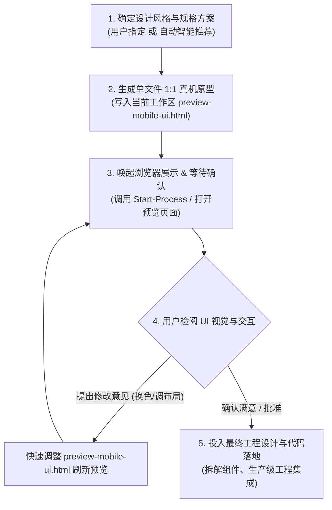
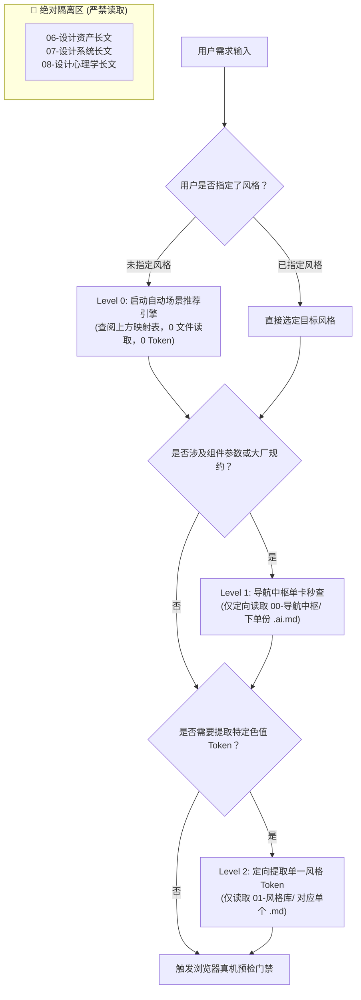

# 🧭 Mobile UI/UX Design & Vibe Coding Skill (移动端外置大脑与智能推荐协议)

> **核心使命**：本 Skill 专为**移动端 UI 界面自动化设计、智能风格推荐、真机浏览器可视化预检与高触觉工程代码直出**打造。
> **三大铁律**：
> 1. **自动风格推荐引擎**：当用户未指定视觉风格时，AI 必须基于软件的**业务场景、目标受众与心理基调**自动完成最佳风格匹配与理由推导，杜绝盲目生成千篇一律的平庸界面。
> 2. **浏览器真机预检门禁 (Mandatory Visual Preview Gate)**：在将代码正式投入最终项目设计或写入业务文件之前，**必须先生成自包含的 1:1 移动真机原型页面 (`preview-mobile-ui.html`) 并在内置/系统浏览器中唤起供用户检阅确认**，待用户确认满意后再投入最终工程交付！
> 3. **上下文安全铁律 (Zero-Context-Waste)**：严禁无目的扫描或全量导入整个知识库。AI 必须严格采用**“三阶渐进式检索 (3-Tier Progressive Disclosure)”**，单次交互上下文开销必须控制在 **300 ~ 500 Tokens** 以内。

---

## 0. 自动行业场景与风格智能推荐引擎 (Domain Classifier & Auto-Recommender)

当用户**没有指定特定风格**（例如仅表达：*“帮我写一个记账 App”*、*“做一个医疗健康挂号页”*、*“设计一个外卖点餐界面”*）时，AI 必须立即启动本推荐引擎，执行**“行业诊断 $\rightarrow$ 风格映射 $\rightarrow$ 心理学理由推导”**：

### 📊 行业场景与视觉风格黄金映射表 (开箱即用，零文件读取)

| 软件业务分类 (App Domain) | 典型应用场景 | 首推风格 (Top 1 最优解) | 备选风格 (Runner-up 反差解) | 核心心理学理由 (Philosophy & Psychology) |
| :--- | :--- | :--- | :--- | :--- |
| **个人财务 / 记账 / 理财** | 每日记账、账单明细、储蓄打卡、股票基金 | **`#02 Minimalist Scandinavian`**<br>(北欧极简纯白) | **`#07 Soft Neumorphism 2.0`**<br>(微柔新拟态) | 极简留白与纯雪白底色能极大**消除用户面对金钱收支的焦虑感**；0.5px 发丝线保证数字严谨清晰。 |
| **开发者工具 / AI 原生终端** | 运维看板、Git 客户端、API 调试、AI 对话 | **`#03 Linear / Raycast Dark`**<br>(极客高精暗黑质感) | **`#05 IBM Carbon Style`**<br>(严谨型数据看板) | 黑曜石底板与 1px 微发丝边框，带来顶级生产力工具的专业感与可信赖度；夜间盯盘极低视觉疲劳。 |
| **Z 世代潮流 / 潮玩 / 文创** | 盲盒抽卡、潮鞋潮服、背单词打卡、青年社群 | **`#01 Neo-Brutalism`**<br>(新野兽派) | **`#16 Memphis Pop Vibrant`**<br>(孟菲斯波普) | 3px 粗黑边框与高饱和撞色，产生强烈的**物理实体冲击与潮玩把玩感**，点击 2px 位移模拟机械按键按压。 |
| **流媒体 / 音视频 / 空间计算** | 音乐播放器、播客、摄影社区、VisionOS 伴侣 | **`#06 Liquid Glassmorphism`**<br>(液态拟玻 / iOS 18 Ambient) | **`#09 Modern Skeuomorphism`**<br>(现代精密拟物工坊) | 半透明液态折射光随封面色彩流动，营造身临其境的空灵沉浸感；磨砂质感高级温润。 |
| **医疗健康 / 医院就医 / 严肃办公** | 挂号问诊、电子病历、企业审批 OA、政务办事 | **`#04 Ant Design Mobile`**<br>(企业移动设计体系) | **`#02 Minimalist Scandinavian`**<br>(北欧极简) | 纯白底色配合蚂蚁蓝，0.5px 物理细线划分信息，杜绝歧义与轻浮装饰，**确定性与效率至上**。 |
| **移动电商 / 外卖餐饮 / 零售交易** | 货架商城、购物车、生鲜买菜、外卖配送 | **`#03 Shopify Polaris 范式`**<br>(移动电商高容错系统) | **`#01 Neo-Brutalism`**<br>(潮玩电商) | 强化的沉底结账栏 (Sticky Checkout) 贴合拇指热区，鲜明突出的价格字阶与可撤销机制，**转化率最高**。 |
| **Web3 / 加密货币 / 硬核电竞** | 加密钱包、NFT 交易、电竞玩家公会、战术工具 | **`#11 Cyberpunk Neon`**<br>(赛博朋克霓虹) | **`#15 Holo-HUD Matrix`**<br>(战术全息矩阵) | 电光青与高能粉霓虹对撞，战术网格与荧光指示，满足数字原住民的未来硬核审美。 |
| **儿童益智 / 萌宠 / 习惯养成** | 亲子启蒙、宠物成长记录、趣味签到、经期健康 | **`#10 Claymorphism 3D`**<br>(3D膨胀黏土风) | **`#17 Dopamine Pastel Candy`**<br>(多巴胺马卡龙软糖) | 大圆角无锐角、高明度低饱和的多巴胺色彩，带来安全、无攻击性且充满童趣的治愈心理暗示。 |

### 🤖 自动推荐时的显式应答范式
当用户未指定风格时，AI 在输出界面的起始模块，**必须首先呈现推荐理由**：
> *“💡 **外置大脑智能风格推断**：识别到您的需求属于【个人财务记账】场景。为化解用户面对频繁数字输入时的心理焦虑，为您自动匹配最佳风格：**#02 Minimalist Scandinavian (北欧极简纯白)**（极致开阔留白、0.5px极细微描边），备选推荐：**#07 微柔新拟态**。已为您生成 1:1 浏览器可交互原型，请先检阅体验...”*

---

## 1. 强制性：浏览器真机可视化预检门禁 (Mandatory Visual Preview Gate)

> **铁律**：**严禁在未经用户浏览器视觉确认前，直接把大批量代码合并或写入最终生产目标文件**。必须执行以下四步闭环：



### 📱 1:1 移动真机沙盒模版规范 (`preview-mobile-ui.html`)
AI 在生成预检文件时，必须包装在一个精致的 1:1 手机真机容器内，外框特性要求：
1. **真实物理外壳尺寸**：机身宽 `390px`，高 `844px`，圆角 `50px`，外层带 `border: 10px solid #1e293b` 钛金属微光与立体双重深阴影；
2. **沉浸式灵动岛与状态栏**：顶部居中预留 `width: 120px; height: 32px` 黑色胶囊灵动岛，显示 `9:41` 时间、WiFi 与 100% 满电图标；
3. **真实可滑动视口**：内部视口 `overflow-y: auto`，滚动条平滑无缝；底部预留 `34px` Home Indicator 交互指示条；
4. **即开即用零依赖**：直接引入 Tailwind CSS CDN (`<script src="https://cdn.tailwindcss.com"></script>`) 或内联 CSS，双击即可全功能运行。

### 💻 唤起浏览器执行指令 (Platform-Native)
- **Windows (PowerShell)**：
  ```powershell
  Start-Process "preview-mobile-ui.html"
  ```
- **向用户发出的门禁确认提示**：
  > “📱 **UI 界面已在浏览器中打开预览**（文件位置：`./preview-mobile-ui.html`）。请点击检阅色彩质感、触控靶心与排版布局。
  > - 如果视觉与交互符合预期，请回复【**确认**】，我将立即为你投入最终工程设计并生成生产级代码；
  > - 如需微调（如调整主色、增加字段、更换布局），请直接告诉我，我将为你实时重载预览！”

---

## 2. 上下文安全检索协议 (Zero-Context-Waste Protocol)

知识库根目录位于：`./`。
AI 必须**逐级按需读取**，绝不可跨级或全量导入！



### Level 1：导航中枢微规约单卡秒查 (限读单文件，$\le 350$ Tokens)
仅当需要具体硬性指标、组件代码模板或避坑红线时，**定向读取且仅读取**以下对应卡片：
- **组件实现与代码模版** $\rightarrow$ 读取 `./00-导航中枢/spec-components.ai.md`
- **大厂物理参数与规范** $\rightarrow$ 读取 `./00-导航中枢/spec-design-systems.ai.md`
- **心理学走查与体验红线** $\rightarrow$ 读取 `./00-导航中枢/spec-laws-ux.ai.md`
- **图标/字体/插画选型** $\rightarrow$ 读取 `./00-导航中枢/spec-assets.ai.md`
- **全景综合秒查总表** $\rightarrow$ 读取 `./00-导航中枢/05 - AI 极简设计规约与避坑秒查手册.md`

### Level 2：定向风格单卡取样 (限读单文件，$\le 500$ Tokens)
当确认了具体风格时，**仅读取对应的一篇风格笔记**（提取 `:root` CSS 变量与提示词）：
- 路径格式：`./01-风格库/<家族文件夹>/<编号. 风格名>.md`
- 提取完毕后立即关闭，绝不继续向下遍历同家族其他风格。

### 🚨 绝对禁止的行为 (Forbidden Actions)
1. ❌ **严禁调用 `list_dir` 递归扫描整个知识库**；
2. ❌ **严禁读取 `06-设计资产索引/`、`07-顶级设计系统/`、`08-设计心理学与走查/` 下的长篇人类百科笔记**；
3. ❌ **单次任务读取的外部 Markdown 文件数量严禁超过 2 个**。

---

## 3. 移动端工程代码生成的四大硬性红线 (Hard Rules)

所有由本 Skill 输出的移动端代码，必须无条件遵循以下物理铁律：

### ① 触控靶心铁律 (Touch Target)
- 任何可点击元素（图标、按钮、胶囊标签）的命中面积**必须 $\ge 44 \times 44\text{pt}$ (iOS) 或 $48 \times 48\text{dp}$ (Android)**；
- 视觉小于 24px 的纯图标，必须通过 `p-3` 或伪元素扩展触控区域，禁止出现裸点击小图标。

### ② 表单防缩放铁律 (iOS 16px Font)
- 移动端所有 `<input>` 与 `<textarea>` 的字号**强制设置为 $\ge 16\text{px}$ (`text-base`)**，绝不允许低于 16px（否则 iOS Safari 聚焦时会强制全局放大页面造成灾难性排版错乱）；
- 数字、电话输入框必须显式声明 `inputmode="numeric"` 或 `inputmode="tel"`。

### ③ 屏幕安全区避让 (Safe Area)
- 底部常驻栏（TabBar、结算条、底部抽屉）必须配置 `pb-8` 或动态适配 `env(safe-area-inset-bottom)`（避让 Home Indicator 34px）；
- 核心操作按钮绝不能贴死屏幕物理最底边。

### ④ 触觉反馈与感知延迟 (Latency & Physics)
- 所有可交互按钮必须配备按下微缩放或位移：`active:scale-[0.96] transition-transform duration-100`；
- 数据加载禁止全屏转菊花，必须优先提供骨架屏（Skeleton Shimmer），确保反馈 $\le 400\text{ms}$。

---

## 4. 标准化交付输出格式 (Delivery Template)

在通过浏览器预检并经用户确认后，AI 进行最终工程交付时按以下标准模块输出：

```markdown
### 🎯 外置大脑设计诊断
- **匹配业务场景**：[如个人财务与资产记账]
- **智能推荐风格**：[风格编号与名称，并阐明为何该风格最赋能该业务]
- **视觉预检确认记录**：[已通过 preview-mobile-ui.html 经用户核验确认]

### 🎨 核心色彩与 Design Tokens
- **主色 (Primary)**: `#HEX` | **背景 (Background)**: `#HEX`
- **几何物理**: [圆角数值、描边粗细、阴影参数]

### 🧩 生产级工程代码交付 (组件解耦 / 生产环境文件)
[在此输出最终生产级前端代码，包含组件模块导出、Design Tokens、TypeScript 接口与 Tailwind 类名]

### ⚠️ 避坑红线自查 (Anti-Patterns Checked)
- ✅ 已通过 44pt 最小触控靶心核对；
- ✅ 已锁定表单 16px 字号防 iOS 强制自动放大；
- ✅ [针对该业务场景的专属避坑说明]。
```
