# 🌐 外部刮削资产与知识库接入导图 (MOC)

> 本图谱是针对 GitHub 顶级开源仓库定向刮削、全中文深度本地化与原子化拆解的**外置扩展大脑**。
> 与本 Vault 内部原有的 30 种风格与 Design Tokens 形成双向链接闭环。

---

## 🗺️ 四大扩展知识网络全景

```mermaid
graph TD
    MOC["00 - UI Vibe Coding Compass (主MOC)"] --> EXT["04 - 外部刮削资产与知识库接入导图"]
    
    EXT --> C1["06-设计资产索引 (Brad Traversy)"]
    EXT --> C2["07-顶级设计系统 (Awesome Design Systems)"]
    EXT --> C3["08-设计心理学与走查 (Laws of UX)"]
    EXT --> C4["03-组件蓝图/现代规范 (shadcn/ui & Radix)"]
    
    C1 --> A1["[[01 - 矢量图标与字体资源精选]]"]
    C1 --> A2["[[02 - 免版税插画与 3D 资产库]]"]
    C1 --> A3["[[03 - 配色生成器与渐变工具箱]]"]
    C1 --> A4["[[04 - 移动端样机 Mockup 与展示工具]]"]
    C1 --> A5["[[05 - 开源 UI 套件与动效资源库]]"]
    
    C2 --> S1["[[01 - Apple Human Interface Guidelines (iOS规范核心)]]"]
    C2 --> S2["[[02 - Google Material Design 3 (Material You 动态规范)]]"]
    C2 --> S3["[[03 - Shopify Polaris (移动电商与商户端交互系统)]]"]
    C2 --> S4["[[04 - Ant Design Mobile (企业级移动端设计体系)]]"]
    C2 --> S5["[[05 - IBM Carbon Design System (严谨型数据与设计规范)]]"]
    
    C3 --> P1["[[01 - 菲茨定律 (Fitts's Law) 与触控靶心]]"]
    C3 --> P2["[[02 - 席克定律 (Hick's Law) 与决策减法]]"]
    C3 --> P3["[[03 - 米勒定律 (Miller's Law) 与信息组块]]"]
    C3 --> P4["[[04 - 雅各布定律 (Jakob's Law) 与心智一致性]]"]
    C3 --> P5["[[05 - 多尔蒂门槛 (Doherty Threshold) 与微动效反馈]]"]
    C3 --> P6["[[06 - 移动端 UI-UX 终极体验自查清单]]"]
    
    C4 --> B1["[[01 - Sheet & Dialog (底部抽屉与模态弹窗交互规范)]]"]
    C4 --> B2["[[02 - ActionSheet & Dropdown (操作表与上下文菜单规范)]]"]
    C4 --> B3["[[03 - Toast & Notification (轻提示与全局通知规范)]]"]
    C4 --> B4["[[04 - Mobile Form & Input (移动端表单与键盘适配规范)]]"]
    C4 --> B5["[[05 - Tabs & SegmentedControl (选项卡与分段控制器规范)]]"]
```

---

## 📦 模块一：设计资产索引 (GitHub: `bradtraversy/design-resources-for-developers`)
涵盖图标、字体、插画、3D 资产、调色板与样机展示工具：
1. [[01 - 矢量图标与字体资源精选|01 - 矢量图标与字体资源精选 (Lucide, Phosphor, Inter, MiSans)]]
2. [[02 - 免版税插画与 3D 资产库|02 - 免版税插画与 3D 资产库 (unDraw, Open Peeps, Spline, Shapefest)]]
3. [[03 - 配色生成器与渐变工具箱|03 - 配色生成器与渐变工具箱 (Realtime Colors, Coolors, Mesh Gradient)]]
4. [[04 - 移动端样机 Mockup 与展示工具|04 - 移动端样机 Mockup 与展示工具 (Shots.so, Rotato, Previewed)]]
5. [[05 - 开源 UI 套件与动效资源库|05 - 开源 UI 套件与动效资源库 (Rive, Lottie, Aceternity UI)]]

---

## 🏛️ 模块二：顶级大厂设计系统 (GitHub: `alexpate/awesome-design-systems`)
全球主流平台与业务领域的核心设计规范与物理参数：
1. [[01 - Apple Human Interface Guidelines (iOS规范核心)|01 - Apple HIG (iOS 规范核心、44pt 触控与触觉反馈)]]
2. [[02 - Google Material Design 3 (Material You 动态规范)|02 - Google Material Design 3 (Material You 动态取色、48dp 靶心与表面层级)]]
3. [[03 - Shopify Polaris (移动电商与商户端交互系统)|03 - Shopify Polaris (电商结账沉底栏、防误触与可撤销机制)]]
4. [[04 - Ant Design Mobile (企业级移动端设计体系)|04 - Ant Design Mobile (企业级移动办公、列表与级联选择器)]]
5. [[05 - IBM Carbon Design System (严谨型数据与设计规范)|05 - IBM Carbon (2x 严苛网格、企业级数据可视化与暗色看板)]]

---

## 🧠 模块三：设计心理学与走查法则 (GitHub: `jonyablonski/laws-of-ux`)
指导移动端交互行为与防踩坑的心理学依据：
1. [[01 - 菲茨定律 (Fitts's Law) 与触控靶心|01 - 菲茨定律 (Fitts's Law) 与触控靶心与边缘效应]]
2. [[02 - 席克定律 (Hick's Law) 与决策减法|02 - 席克定律 (Hick's Law) 与选择瘫痪、渐进式披露]]
3. [[03 - 米勒定律 (Miller's Law) 与信息组块|03 - 米勒定律 (Miller's Law) 与信息组块、手机号银行卡分段]]
4. [[04 - 雅各布定律 (Jakob's Law) 与心智一致性|04 - 雅各布定律 (Jakob's Law) 与用户心智、原生手势继承]]
5. [[05 - 多尔蒂门槛 (Doherty Threshold) 与微动效反馈|05 - 多尔蒂门槛 (Doherty Threshold) 与 400ms 响应、骨架屏与乐观更新]]
6. [[06 - 移动端 UI-UX 终极体验自查清单|06 - 移动端 UI-UX 终极体验自查清单 (发布前全维度走查 Checklist)]]

---

## 🧩 模块四：现代 UI 组件与交互蓝图 (GitHub: `shadcn-ui/ui`)
现代触控屏幕核心组件的设计解剖、手势与无障碍红线：
1. [[01 - Sheet & Dialog (底部抽屉与模态弹窗交互规范)|01 - Sheet & Dialog (自底抽出抽屉与模态弹窗对比)]]
2. [[02 - ActionSheet & Dropdown (操作表与上下文菜单规范)|02 - ActionSheet & Dropdown (移动端操作表与高危操作隔离)]]
3. [[03 - Toast & Notification (轻提示与全局通知规范)|03 - Toast & Notification (顶部灵动胶囊提示与操作撤销)]]
4. [[04 - Mobile Form & Input (移动端表单与键盘适配规范)|04 - Mobile Form & Input (iOS 16px防缩放、inputmode与键盘避让)]]
5. [[05 - Tabs & SegmentedControl (选项卡与分段控制器规范)|05 - Tabs & SegmentedControl (药丸分段控制器与滑动选项卡)]]

---

## 🔗 返回上层中枢
- 返回 Vault 顶层主地图：[[00 - UI Vibe Coding Compass (MOC)]]
